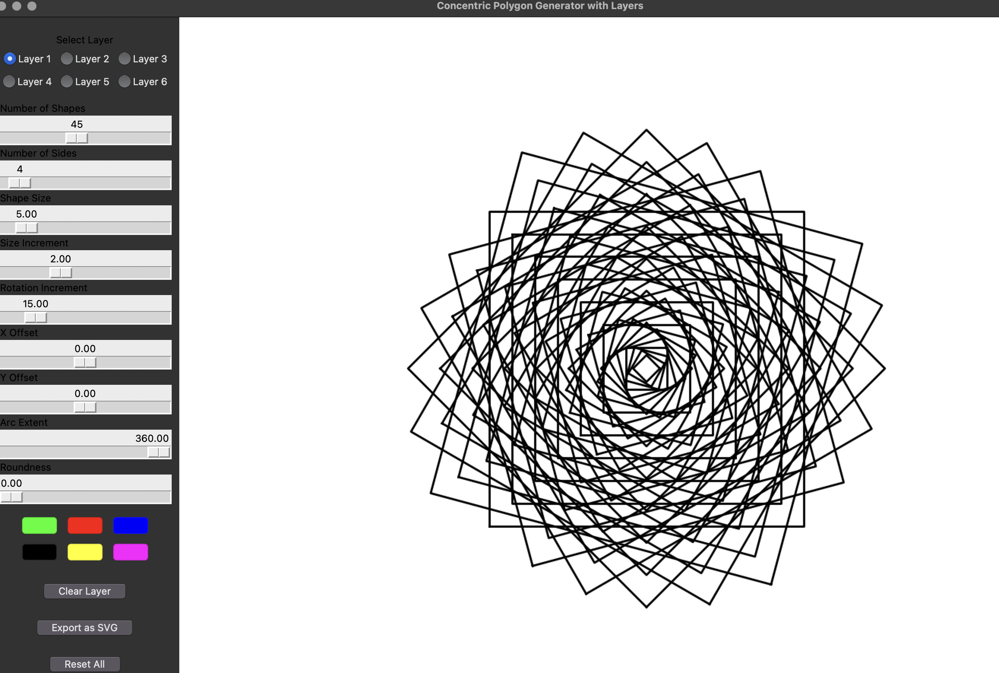
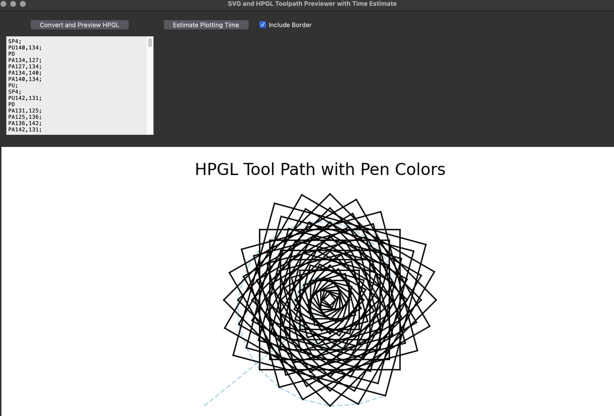

# Concentric Polygon Generator with HPGL Tool Path Preview

This project is a **Concentric Polygon Generator** with **Layered Editing** and **HPGL Tool Path Generation**. It provides a graphical interface for creating polygonal designs with multiple layers, exporting them as SVG, and generating HPGL code for plotting on devices like the **HP 7475A** plotter.

## Features

- **Multi-Layer Editing**: Up to six independent layers, each with its own set of properties such as number of sides, size, rotation, and color.
- **SVG Export**: Generate SVG files from your designs with the option to post-process the file and remove unnecessary borders.
- **HPGL Tool Path Preview**: Convert the SVG into HPGL code, visualize tool paths with color-coded pens, and estimate plotting time.
- **Pen-Up Movements**: Pen-up movements are represented as dashed blue lines, and pen-down movements reflect the actual color of the plotter pens.

### Main Window



- **Shape Control**: Sliders to control the number of sides, size, rotation, and more for each layer.
- **Color Selection**: Choose from predefined colors for each layer.
- **Export to SVG**: Export the current design as an SVG file.
- **Tool Path Generation**: Open a new window to convert the SVG into HPGL code and visualize tool paths.

### Tool Path Window



- **HPGL Code Generation**: Generate and view the HPGL code for plotting.
- **Tool Path Visualization**: Visualize the pen movements, with pen-down movements shown in the correct color, and pen-up movements as dashed lines.
- **Plotting Time Estimation**: Estimate how long it will take to plot the design on a plotter.

## Installation

1. Clone the repository:

    ```bash
    git clone https://github.com/your-repository.git
    cd your-repository
    ```

2. Install the required dependencies:

    ```bash
    pip install -r requirements.txt
    ```

  

## Running the Project

To run the project, execute the following command in your terminal:

```bash
python main.py
